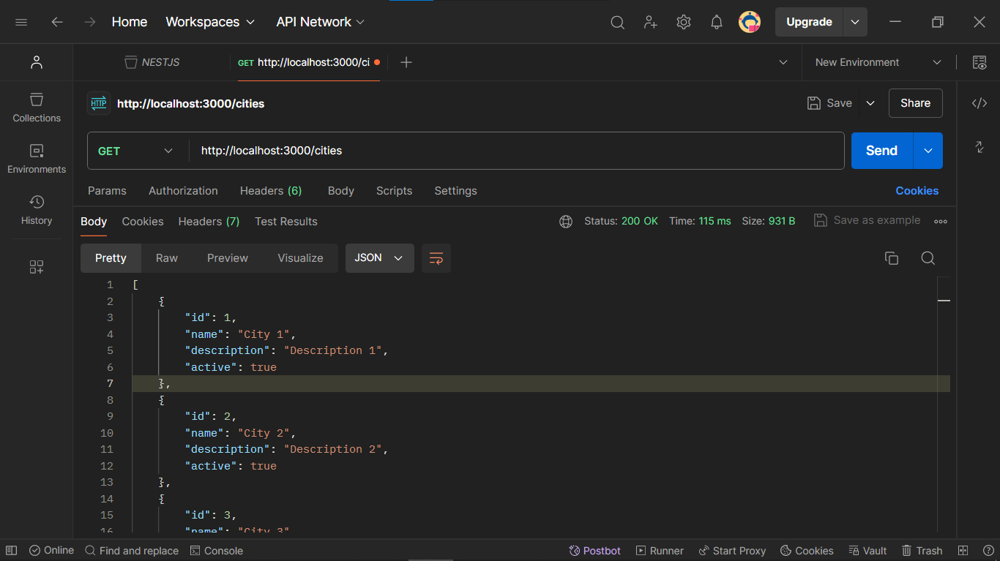
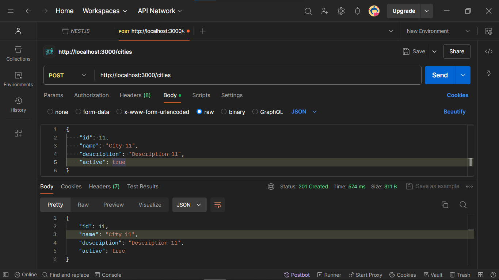
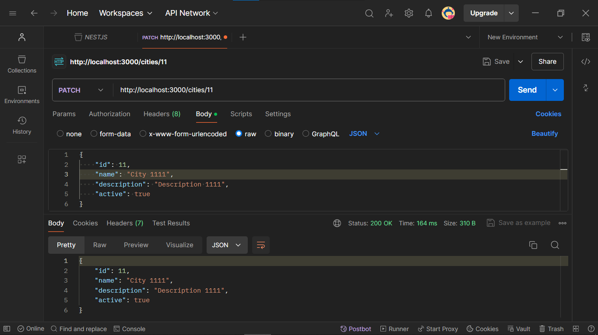
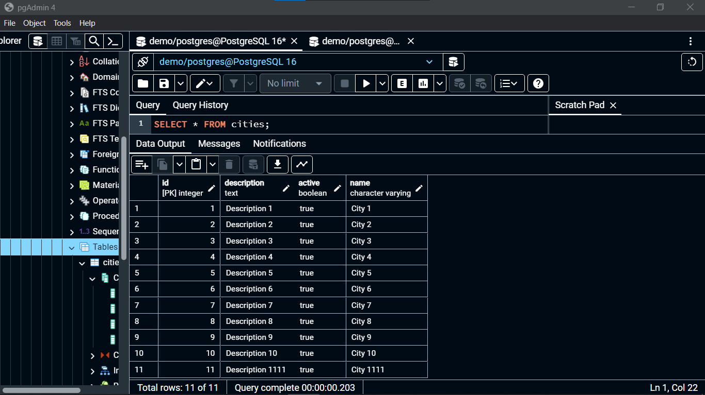
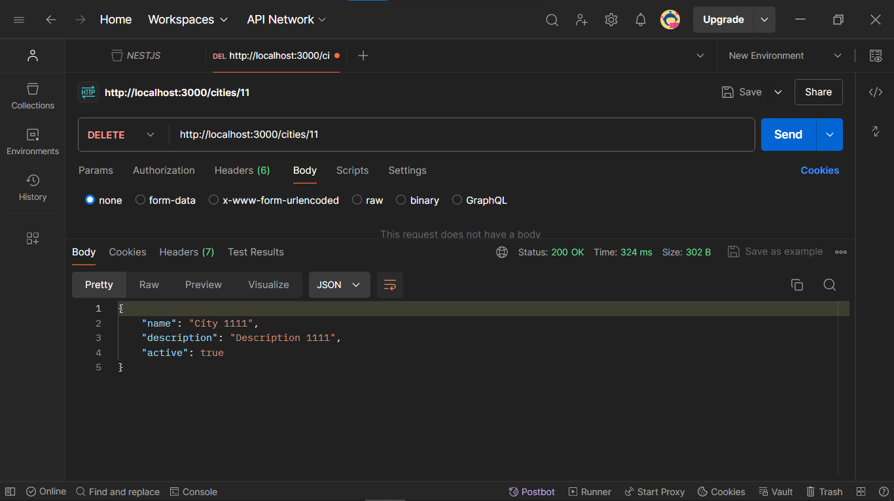
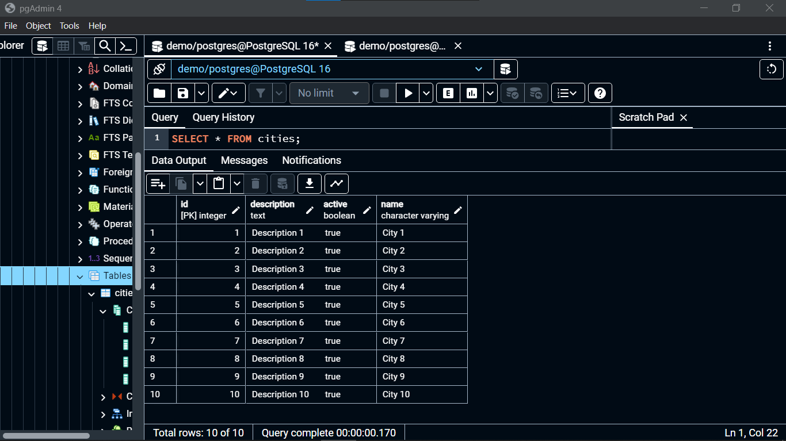

# CRUD DE CIDADES COM NESTJS
👨‍🏫ESSE APP É UMA API RESTFUL DE CRUD DE CIDADES COM NESTJS E POSTGRESQL.

 <br> 
 <br> 
 <br> 
 <br> 
 <br> 
 <br> 
 <br> 
 <br> 

## DESCRIÇÃO:
Este projeto é uma API REST desenvolvida com NestJS, um framework Node.js para construção de aplicativos eficientes e escaláveis no lado do servidor. Ele utiliza PostgreSQL como banco de dados para armazenar informações sobre cidades.

## FUNCIONALIDADES:
1. **Listar Cidades**: A rota `http://localhost:3000/cities` com GET Retorna uma lista de cidades cadastradas no sistema.
2. **Detalhes da Cidade**: A rota `http://localhost:3000/cities/:id` pode ser usada para obter os detalhes de uma cidade específica, onde `:id` é o identificador único da cidade.
3. **Criar Cidade**: Há uma funcionalidade para criar uma nova cidade, que pode ser feita através de uma requisição POST para a rota `http://localhost:3000/cities`.
4. **Atualizar Cidade**: A atualização de uma cidade existente pode ser feita através de uma requisição PUT ou PATCH para a rota `http://localhost:3000/cities/:id`, onde `:id` é o identificador único da cidade a ser atualizada.
5. **Excluir Cidade**: Excluir uma cidade existente pode ser feito através de uma requisição DELETE para a rota `http://localhost:3000/cities/:id`, onde `:id` é o identificador único da cidade a ser excluída.

## EXECUTANDO O PROJETO:
1. **Configuração do Banco de Dados:**
   - Antes de executar o projeto, certifique-se de ter o PostgreSQL instalado em seu ambiente. Em seguida, importe o arquivo `./DATABASE/DATABASE.sql` para o seu banco de dados PostgreSQL. Este arquivo contém a estrutura da tabela necessária para o funcionamento do projeto.

2. **Configuração das Variáveis de Ambiente:**
   - Abra o arquivo `./CODIGO/.env` e ajuste as configurações de acordo com as suas credenciais do banco de dados PostgreSQL:

     ```shell
      DB_HOST=127.0.0.1
      DB_PORT=5432
      DB_USERNAME=[seu_usuario]
      DB_PASSWORD=[sua_senha]
      DB_NAME=demo
     ```
   Certifique-se de fornecer o nome de usuário e senha corretos para acessar o banco de dados PostgreSQL. O nome do banco de dados `demo` pode ser ajustado conforme necessário.

3. **Instalando as Depêndencias:**
   - Para instalar as dependências listadas no arquivo "package.json", você pode usar o comando `npm install` no terminal. Certifique-se de estar no diretório do seu projeto onde o arquivo "package.json" está localizado. O npm irá ler o arquivo "package.json" e instalar todas as dependências listadas nele. 

   - Aqui está o comando:

   ```bash
   npm install
   ```

4. **Subindo o Servidor:**
   - Para subir o servidor, no diretório do seu [projeto](./CODIGO/), digite o seguinte comando no Terminal/CMD:
   ```bash
   npm run start
   ```

   OU:

   ```bash
   npm run start:dev
   ```

5. **Requisições HTTP:**

   1. **Listar Cidades**: Acesse `http://localhost:3000/cities` em seu navegador ou faça uma requisição GET usando uma ferramenta como Postman ou cURL para obter a lista de cidades.

   2. **Detalhes da Cidade**: Acesse `http://localhost:3000/cities/:id` substituindo `:id` pelo identificador único da cidade desejada para obter os detalhes da cidade.

   3. **Criar Cidade**: Faça uma requisição POST para `http://localhost:3000/cities` com os dados da nova cidade no corpo da requisição; Exemplo:

   ```json
   {
      "id": 11,
      "name": "City 11",
      "description": "Description 11",
      "active": true
   }
   ```

   4. **Atualizar Cidade**: Faça uma requisição PUT ou PATCH para `http://localhost:3000/cities/:id` com os dados atualizados da cidade no corpo da requisição.

   5. **Excluir Cidade**: Faça uma requisição DELETE para `http://localhost:3000/cities/:id` para excluir a cidade com o identificador `:id`.

## NÃO SABE?
- Entendemos que para manipular arquivos em `HTML`, `CSS` e outras linguagens relacionadas, é necessário possuir conhecimento nessas áreas. Para auxiliar nesse aprendizado, oferecemos cursos gratuitos disponíveis:
* [CURSO DE NODEJS](https://github.com/VILHALVA/CURSO-DE-NODEJS)
* [CURSO DE POSTGRESQL](https://github.com/VILHALVA/CURSO-DE-POSTGRESQL)
* [CURSO DE NESTJS](https://github.com/VILHALVA/CURSO-DE-NESTJS)
* [CURSO DE TYPESCRIPT](https://github.com/VILHALVA/CURSO-DE-TYPESCRIPT)
* [CURSO DE API REST](https://github.com/VILHALVA/CURSO-DE-API-REST)
* [CONFIRA MAIS CURSOS](https://github.com/VILHALVA?tab=repositories&q=+topic:CURSO)

## CREDITOS:
- [PROJETO CRIADO PELO "ZestArinze"](https://github.com/ZestArinze/nestjs-postgresql-crud-example)
- [VEJA O VIDEO DESSE PROJETO](https://youtu.be/pI9C7NH4K5c?si=WHvYFUnCbPvma6vE)
- [PROJETO FEITO PELO VILHALVA](https://github.com/VILHALVA)


